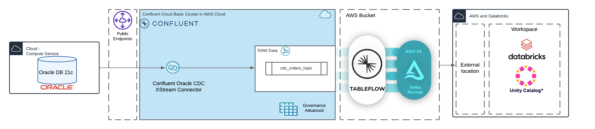
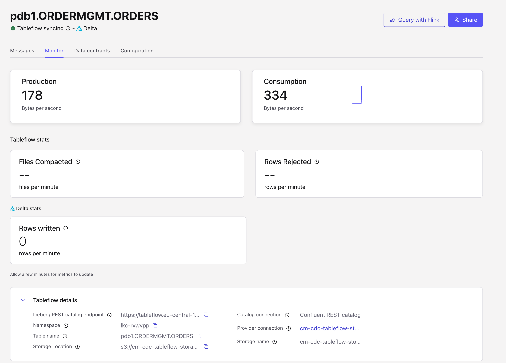

# Confluent CDC Use case: the smartest way to bring data from Oracle to Databricks for an 360 customer view (ATG)

This Demo will show very easily how our new Oracle CDC Connector based on the Oracle XStream Concept will work. We will Synch customer data from Oracle DB 21c to Confluent Cloud.
All table topics based on tables from Oracle will be enabled for tableflow with own AWS S3 bucket. We store the data as Delta format in S3 and will use Databricks with external location into the S3 bucket and do the analysis with Genie by Databricks.



> [!IMPORTANT]
> The new Oracle CDC Connector from Confluent based on the Oracle XStream API is GA. The licenses to run XStream Outbound on Oracle DB is included in connector. Please ask your Confluent Account Executives.

> [!CAUTION]
> The workshop was tested with MacBook Pro M3. If you run Apple Mac Silicon processor please [prepare](https://medium.com/@immanoj42/terraform-template-v2-2-0-does-not-have-a-package-available-mac-m1-m2-2b12c6281ea), so that your terraform execution is working fine.

This simple Demo will show case Shift-Left archicture pattern and will show that with simple step you run analysis in Databricks on Oracle data.

The demo deployment is based on terraform for the most components (Confluent Cloud Cluster, Oracle 21c, XStream Connector, Databricks (comming soon)). The new Connector will also run on local desktop with docker including, connect cluster, Grafana/Prometheus.

# Table of Contents
[Deploy Demo](#deploy-demo)
1. [Deploy Confluent Cloud Cluster](#1-deploy-confluent-cloud-cluster)
2. [Deploy the Oracle Database](#2-deploy-the-oracle-database)
3. [Deploy the Oracle CDC Connector (XStream)](#3-deploy-the-oracle-cdc-connector-xstream)
4. [Deploy databricks (coming soon)](#4-deploy-databricks)
5. [Destroy everyting](#5-destroy-everyting)


## Deploy demo

Get this repository on your desktop

```bash
git clone https://github.com/ora0600/confluent-cdc2databricks.git
cd confluent-cdc2databricks
```

5 Simple steps to run this demo:

0. Do the setup in AWS, Confluent Cloud and Databricks (enter values in `.account` file)
1. Deploy the Confluent Cloud cluster first with terraform. terraform must be installed on desktop, and you need a Confluent Cloud Account. Terraform need API Keys from Confluent Cloud and a complete `.account` file
2. Deploy the 21c database in AWS with terraform. You need an aws account, a key, and a ssh key for the EC2 Instance.
3. Deploy the new Connector with terraform or manually with docker on your desktopm, then Grafana and Prometheus are included. 
4. Deploy Databricks with external location to tableflow and do genie analysis: Show the top 3 customers.
5. Destroy demo environment.

I assume that you having an AWS account([Sign-up](https://aws.amazon.com/resources/create-account/)) and Confluent Cloud([Sign-up](https://www.confluent.io/confluent-cloud/tryfree/)). You know how to create [AWS Keys](https://docs.aws.amazon.com/IAM/latest/UserGuide/id_credentials_access-keys.html), Confluent Cloud [API Keys](https://docs.confluent.io/cloud/current/security/authenticate/workload-identities/service-accounts/api-keys/manage-api-keys.html#add-an-api-key), Confluent CLoud [Tableflow Keys](https://docs.confluent.io/cloud/current/topics/tableflow/get-started/quick-start-managed-storage.html#step-3-set-up-access-to-the-iceberg-rest-catalog) and how to create an [AWS ECS ssh key](https://docs.aws.amazon.com/AWSEC2/latest/UserGuide/create-key-pairs.html).


Create first our own S3 Bucket in AWS,  **S3 Bucket**: cm-cdc-tableflow-storage in Region FRANKFURT

> [!IMPORTANT]
> If you re-use the S3 bucket for several demos, please delete the content in this S3 bucket, before deploying the cluster.

Now, you can fill out the `.accounts` property file before you start;

```bash
# Confluent Cloud - choose your own names abbreviation
export TF_VAR_confluent_cloud_api_key="CCLOUD KEY"
export TF_VAR_confluent_cloud_api_secret="CCLOUD SECRET"
export TF_VAR_cloud_provider="AWS"
export TF_VAR_cc_cloud_region="eu-central-1"
export TF_VAR_cc_env_name="<cm>demo-xstream-cdc"
export TF_VAR_cc_cluster_name="cc_aws_cluster"
export TF_VAR_sr_package="ADVANCED"
# Tableflow - choose your own names abbreviation
export TF_VAR_tableflow_api_key="TABLEFLOW CCLOUD API KEY"
export TF_VAR_tableflow_api_secret="TABLEFLOW CCLOUD API SECRET"
export TF_VAR_customer_role_name="cm-cdc-tableflow-storage-role_new"
export TF_VAR_customer_policy_name="cm-TableflowS3AccessPolicy"
export TF_VAR_cc_provider_integration_name="cm-cdc-tableflow-storage-integration"
export TF_VAR_s3_bucket_name="cm-cdc-tableflow-storage-new"
# AWS Cloud - choose your own names abbreviation
export aws_access_key="AWS KEY"
export aws_secret_key="AWS SECRET"
export aws_region="eu-central-1"
export ssh_key_name="<cm>awsdemoxstream"
export owner_email="<yourname>@confluent.io"
export myip="X.X.X.X/32"
```
save the .accounts file into main folder.

### 1. Deploy Confluent Cloud Cluster

Before deploying the cluster and you did already use an existing S3 bucket from older demos. Please delete the content of this bucket before deploying the cluster.

run terraform fpr deploying the confluent cluster.

```bash
cd ccloud-cluster/
source ../.accounts
terraform init
terraform plan
terraform apply
``` 

Confluent Cloud should be created successfully. The Output shows what was created.
The Confluent Cloud Cluster, including Topics and Schemas as well as Tableflow setup and enabling for all topics.

Now, you can check finally in topic viewer, if all topics are synched with tableflow. If they are failed you need to resume Tableflow for each topic.


### 2. Deploy the Oracle Database

> [!IMPORTANT]
> Please be prepared and informed that the DB Port 1521 will automatically get a AWS Security Policy to allow only the MYIP and the Confluent Cloud Cluster egress IPs (if set from confluent) to access. If this is not your plan, change your policy in `main.tf` for Port 1521: e.g. to allow all `cidr_blocks = [0.0.0.0/0]` 


Oracle 21c XE build during runtime:
run terraform:

```bash
cd ../oraclexe21c/
source .aws-env
terraform init
terraform plan
terraform apply
```

Terraform will output everything you need to play with Oracle21c:

```bash
A01_PUBLICIP = "X.X.X.X"
A02_ORACLESERVERNAME = "X.X.X.X"
A03_SSH = "SSH  Access: ssh -i ~/keys/cmawsdemoxstream.pem ec2-user@X.X.X.X "
A04_OracleAccess = "sqlplus sys/confluent123@XE as sysdba or sqlplus sys/confluent123@XEPDB1 as sysdba or sqlplus ordermgmt/kafka@XEPDB1  c##ggadmin/Confluent12!@XE Port:1521  HOST:X.X.X.X"
``` 
First we need to add some config for new CDC Connector in the database. 
I changed the redo log size of the DB, one inactive Redo need to be deleted.
Then the CDC Connector need an Outbound Server in Oracle DB. The main privileges are already set. And then we start some orders generation in the DB:

```bash
# ssh into Oracle19c compute instances, it takes a while till Oracle DB is up and running
ssh -i ~/keys/cmawsdemoxstream.pem ec2-user@X.X.X.X 
ps -ef | grep XE  
# You can also check the logs
sudo tail -f /var/log/cloud-init-output.log

# lots of ora processes should run e.g ora_dbw0_XE , if you see
# /bin/bash /opt/oracle/runOracle.sh
# /bin/bash /opt/oracle/startDB.sh
# Then DB is still in boot phase
# wait till you see ...finished...
sudo docker exec -it oracle21c /bin/bash
# Please check redos first
sqlplus sys/confluent123@XE as sysdba
SQL> set lines 200
COLUMN MEMBER FORMAT A40^
COLUMN MEMBERS FORMAT 999
SELECT a.group#,b.member,a.members, a.bytes/1024/1024 as MB, a.status FROM v$log a,v$logfile b WHERE a.group# = b.group#;
# If you see redo1-3 please drop them, e.g. in my case
#   GROUP#  MEMBER                            MEMBERS  MB       STATUS
# -------- --------------------------------- --------- -------  ------
#        1 /opt/oracle/oradata/XE/redo01.log 1         200      INACTIVE
# Drop old REDO, if  redo01.log is INACTIVE, this guy has to less MB allocated.   
ALTER DATABASE DROP LOGFILE GROUP 1; 
# We need only these REDOS
#   GROUP#  MEMBER                            MEMBERS  MB       STATUS
# -------- --------------------------------- --------- -------  ------
#        4 /opt/oracle/oradata/XE/redo04.log 1         2048     CURRENT
#        5 /opt/oracle/oradata/XE/redo05.log 1         2048     UNUSED
#        6 /opt/oracle/oradata/XE/redo06.log 1         2048     UNUSED

# now configure Xstream
SQL> connect c##ggadmin@XE
Password is Confluent12!
# execute The CREATE_OUTBOUND procedure in the DBMS_XSTREAM_ADM package is used to create a capture process, queue, and outbound server in a single database
# Depended on your table.include.list in connector setup you would like to add alle tables here: In my case I do have 13 tables, you can use an arry like I do, or a comma sperated list
SQL> DECLARE
  tables  DBMS_UTILITY.UNCL_ARRAY;
  schemas DBMS_UTILITY.UNCL_ARRAY;
BEGIN
    tables(1)   := 'ORDERMGMT.ORDERS';
    tables(2)   := 'ORDERMGMT.ORDER_ITEMS';
    tables(3)   := 'ORDERMGMT.EMPLOYEES';
    tables(4)   := 'ORDERMGMT.PRODUCTS';
    tables(5)   := 'ORDERMGMT.CUSTOMERS';
    tables(6)   := 'ORDERMGMT.INVENTORIES';
    tables(7)   := 'ORDERMGMT.PRODUCT_CATEGORIES';
    tables(8)   := 'ORDERMGMT.CONTACTS';
    tables(9)   := 'ORDERMGMT.NOTES';
    tables(10)  := 'ORDERMGMT.WAREHOUSES';
    tables(11)  := 'ORDERMGMT.LOCATIONS';
    tables(12)  := 'ORDERMGMT.COUNTRIES';
    tables(13)  := 'ORDERMGMT.REGIONS';
    tables(14)  := NULL;
    schemas(1)  := NULL;        
  DBMS_XSTREAM_ADM.CREATE_OUTBOUND(
    capture_name          =>  'confluent_xout1',
    server_name           =>  'xout',
    source_container_name =>  'XEPDB1',   
    table_names           =>  tables,
    schema_names          =>  schemas,
    comment               => 'Confluent Xstream CDC Connector' );
-- set retention for 7 days
    DBMS_CAPTURE_ADM.ALTER_CAPTURE(
      capture_name => 'confluent_xout1',
      checkpoint_retention_time => 7
    );
END;
/
# You can drop out OUTBOUND Server by
# SQL> execute DBMS_XSTREAM_ADM.DROP_OUTBOUND('XOUT');
# Run order inserts
SQL> connect ordermgmt/kafka@XEPDB1 
SQL> begin
   produce_orders;
end;
/
```

DB is prepared and Orders will be inserted into DB table..

### 3. Deploy the Oracle CDC Connector (XStream)

Before we continue, we must be pretty sure, that the following steps are finished.

* Confluent Cloud Cluster is running
* Oracle DB 21c compute service is running
* for fully-managed connnector nothing to prepare
* For self-managed connector (on Docker) und must do the following:
  - We need a Confluent Platform Connect 7.6 or higher. I use Connect latest version (7.8.1) in Dokerfile, which is automatically build with running docker-compose and for this I used JDK 17, check your java: `java -version`
    - Java Version 17 or higher `java -version`
    - I created a folder `cdc-connector/confluent-hub-components` and downloaded there the [New CDC Connector](https://www.confluent.io/hub/confluentinc/kafka-connect-oracle-xstream-cdc-source) zip und unzipped it.
    - in the folder `confluent-hub-components/confluentinc-kafka-connect-oracle-xstream-cdc-source-1.0.1/lib/` I copied the files `ojdbc8.jar` and `xstreams.jar` which I download from the instant client for Linux [Download](hhttps://download.oracle.com/otn_software/linux/instantclient/1926000/instantclient-basic-linux.arm64-19.26.0.0.0dbru.zip)
    - in the Dockerfile I included in the connect container the Oracle Instant client and set the LD_LIBRARY_PATH env variable (see `Dockerfile`)
    - If you run a different system then me (MacBook M3, MacOS) you need to find an instant client for other Hardware.
    - We did change the the Dockerfile and installed Oracle Instant Client and set LD_LIBRARY_PATH in the docker container. That's why in `docker-compose-cdc-ccloud_new.yml` your will see only `build: .` and this mean, that the container will build based on the `Dockerfile`.

> [!IMPORTANT]
> the handling with the instant client must be fit your OS and HW setup. I am running Apple M3 HW on MacOs, that's why I download  `https://download.oracle.com/otn_software/linux/instantclient/1926000/instantclient-basic-linux.arm64-19.26.0.0.0dbru.zip` and in DockerFile I use `https://download.oracle.com/otn_software/linux/instantclient/1926000/instantclient-basic-linux.arm64-19.26.0.0.0dbru.zip`. You see the main piece is ARM64 HW here for my setup. For your setup you may need different Zips.

You can run the connector 
* in Confluent Cloud as fully-managed connector or
* self-managed on your desktop  with docker.

#### fully-managed connector

Run terraform

> [!IMPORTANT]
> If you run fully-managedc connector then we run with AVRO

```bash
cd ../cdc-connector
source .ccloud_env
terraform init
terraform plan
terraform apply
```

The fully managed connector should now run in Confluent Cloud.

#### self-managed Connector

Before starting the connect cluster, be sure that Docker Desktop is running.

```bash
docker ps
```

Start the connect cluster: 

```bash
cd ../cdc-connector
# start environment, for Confluent colleques: Shutdown VPN, otherwise the instant client can not be loaded
docker-compose -f docker-compose-cdc-ccloud_new.yml up -d
docker-compose -f docker-compose-cdc-ccloud_new.yml ps
```

Connect-Cluster will run on your Desktop, the docker-compose includes connect cluster, Grafana and Prometheus. 
See [Grafana Dashboard](http://localhost:3000/login) login with admin/admin, and check [Prometheus Targets](http://localhost:9090/targets)
You can in Prometheus search for connector metrics from XStream connector if you created the connector (we be do later). Open Prometheus UI (http://prometheus:9090/graph).
Run the following query: `{connector="XSTREAMCDC0"}` if connector is running.

We will first check the connect cluster first.

```bash
# Connect cluster status
curl localhost:8083/ | jq
# No running connectors so far
curl localhost:8083/connectors | jq
# One Conenctor plugin for OracleXStreamSourceConnector CDC and mirror maker
curl localhost:8083/connector-plugins/ | jq
```

Start Connector

```bash
# Are connectors running?
curl -s -X GET -H 'Content-Type: application/json' http://localhost:8083/connectors | jq
# start connector with correct json config
curl -s -X POST -H 'Content-Type: application/json' --data @cdc_ccloud.json http://localhost:8083/connectors | jq
# Check status
curl -s -X GET -H 'Content-Type: application/json' http://localhost:8083/connectors/XSTREAMCDC0/status | jq
# check config
curl -s -X GET -H 'Content-Type: application/json' http://localhost:8083/connectors/XSTREAMCDC0/config | jq
# DELETE If connector is running, do not delete, only if it fails, then delete and fix the error and start again
# curl -s -X DELETE -H 'Content-Type: application/json' http://localhost:8083/connectors/XSTREAMCDC0 | jq
# We need to stop with CP 
# curl -s -X PUT -H 'Content-Type: application/json' http://localhost:8083/connectors/XSTREAMCDC0/stop | jq
# pause
# curl -s -X PUT -H 'Content-Type: application/json' http://localhost:8083/connectors/XSTREAMCDC0/pause | jq
# Update offset
# curl -s -X PATCH -H 'Content-Type: application/json' http://localhost:8083/connectors/XSTREAMCDC0/offsets \
#--data '{"offsets":[{"partition":{"server": "ORCLPDB1"},"offset":{"scn": "2379825"}}]}' || jq
# Update config
curl -s -X PUT -H 'Content-Type: application/json' --data @cdc_ccloud_update.json http://localhost:8083/connectors/XSTREAMCDC0/config || jq
# RESUME"
# curl -s -X PUT -H 'Content-Type: application/json' http://localhost:8083/connectors/XSTREAMCDC0/resume | jq
# RESTART
# curl -s -X POST http://localhost:8083/connectors/XSTREAMCDC0/restart | jq
```

Connector is running.

You can check in Confluent Cloud UI all the topics. The `pdb1.ORDERMGMT.ORDERS` topic should be get events (new orders).
Now, you can play around with the connector and also check what is going around in Tableflow and your AWS S3 Bucket



### 4. Deploy Databricks

coming soon. 
In the meantime you can follow the [Confluent Documentation](https://docs.confluent.io/cloud/current/topics/tableflow/get-started/quick-start-delta-lake.html#step-4-query-delta-lake-tables-from-databricks) how to create external location in Databricks to our S3 bucket. 
Or use the Repo from my colleague in Github. How to build [Databricks queries from ZamZam](https://github.com/confluentinc/workshop-tableflow-databricks/tree/main).


### 5. Destroy everyting

Next Stop CDC Connector and shotdown connect cluster.

self-managed:

```bash
cd ../cdc-connector
curl -s -X DELETE -H 'Content-Type: application/json' http://localhost:8083/connectors/XSTREAMCDC0 | jq
docker-compose -f docker-compose-cdc-ccloud_new.yml down -v
docker images
docker rmi <connect image id>
```

fully-managed:

```bash
cd ../cdc-connector
source .ccloud_env
terraform destroy
```

Next the oracle21c instance:

```bash
cd ../oraclexe21c
source .aws_env 
terraform destroy
```

Next the confluent cloud cluster:

```bash
cd ../ccloud-cluster-tableflow
source ../.accounts
terraform destroy
```

And finally clean your S3 Bucket.

Demo is finished and all resources are destroyed. Hope you had fun.
Thank you for attending.


